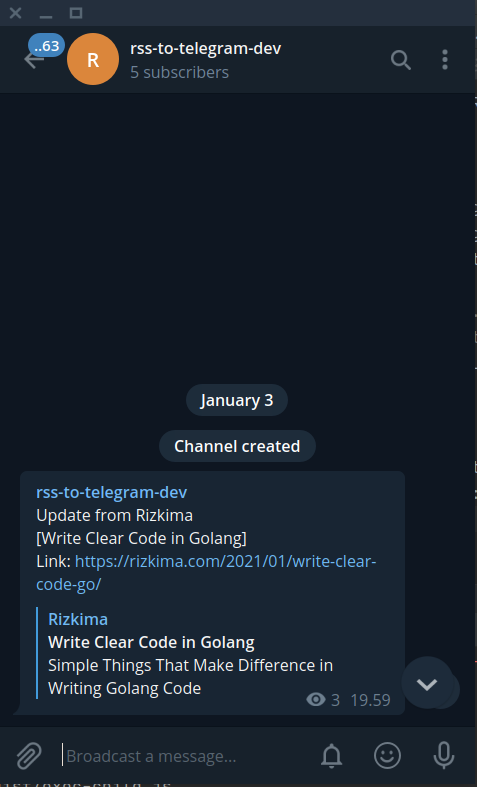

# Rui

Action Hosted RSS Notifier, currently support telegram for sending message.

## How to Use

1. Create telegram channel: https://telegram.org/tour/channels
2. Create telegram bot: https://core.telegram.org/bots#6-botfather
3. Add your bot into channel as admin: https://stackoverflow.com/questions/33126743/how-do-i-add-my-bot-to-a-channel
4. Create your own repository with this template: https://github.com/rzkmak/rui-rss-template
5. Update `rss.yaml` and add your site on there. For the `chat_id` field, it will be your username channel. For example channel https://t.me/rsstotelegramdev, chat_id is `rsstotelegramdev`
6. Update `.github/actions/rui`, see the cron scheduled task. Adjust it as necessary.
7. Add your TELEGRAM_TOKEN secrets in: https://docs.github.com/en/free-pro-team@latest/actions/reference/encrypted-secrets
8. Done!

## Example
Repository: https://github.com/rzkmak/rui-demo
Channel: https://t.me/rsstotelegramdev

## Contribution are welcome!
